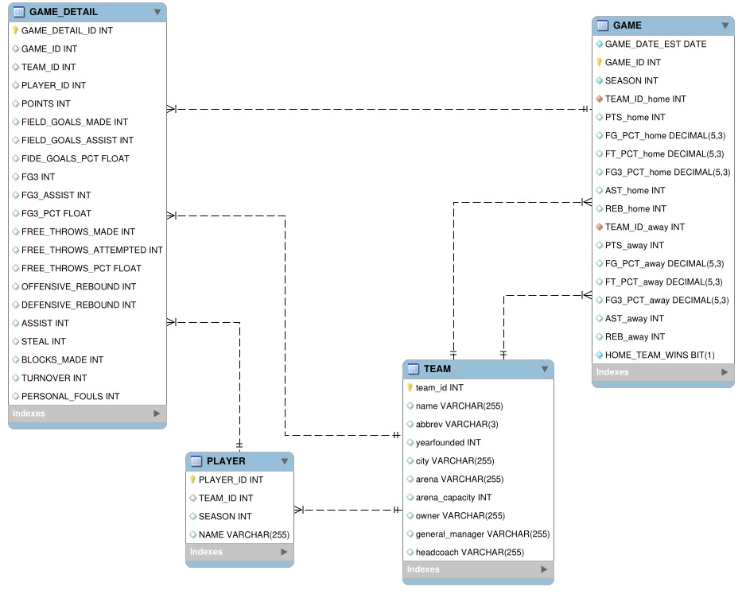

# **Resilia - modulo 3 - Grupo 3🚀**

## Banco de dados escolhido: *NBA*🏀

A ideia principal do projeto era modular um banco com dados de nossa escolha. O grupo decidiu
fazer um banco de dados com todas as informações da National Basketball Association(N.B.A).
O banco possui informações detalhadas das partidas, times, jogadores e etc.

## Imagem do banco💻

## Como foi feito?🤔

Recebemos algumas planilhas com os dados das partidas, times, jogadores e etc. E a partir disso
modulamos o banco de dados, utilizando o MySQL e usamos o Docker para os testes. Primeiro criamos o banco e depois criamos algumas
tabelas, como: GAME, GAME_DETAIL, PLAYER e TEAM. Logo após a criação do banco, subimos ele para
o servidor da Resilia para ser avaliado e testado. Também fizemos algumas perguntas e utilizamos
queries como respostas para tais perguntas e todas elas estão nos códigos do repositório.

## Tecnologias utilizadas🦉

<ul>
  <li>MySQL</li>
  <li>Docker</li>
</ul>

## Autores😊

### Ivan Coelho😃
 <ul>
  <li><a href="https://www.linkedin.com/in/ivancda/">LinkedIn</a></li>
  <li><a href="https://github.com/ivancda">Github</a></li>
</ul>

### Isabella Sales🤗
 <ul>
  <li><a href="#">LinkedIn</a></li>
  <li><a href="https://github.com/IsabellaSSantos">Github</a></li>
</ul>

### João Victor Moura😁
 <ul>
  <li><a href="linkedin.com/in/jovimoura10/">LinkedIn</a></li>
  <li><a href="https://github.com/jovimoura">Github</a></li>
</ul>

### Letícia Bedoni😉
 <ul>
  <li><a href="https://www.linkedin.com/in/leticia-souza04/">LinkedIn</a></li>
  <li><a href="https://github.com/leticiabedoni">Github</a></li>
</ul>

### Renan Martins😎
 <ul>
  <li><a href="#">LinkedIn</a></li>
  <li><a href="https://github.com/renanmartins1813">Github</a></li>
</ul>

## Para os devs:

### Como acessar o banco no servidor da Resilia no Workbench.

- Crie a conexão da seguinte maneira:
  1. Dê um connection name
  2. Coloque em hostname o seguinte IP: 3.144.153.204
  3. Username está no grupo do zapp
  4. Clique no Password: Store in Vault e ponha o password que está no grupo do zapp
  5. Clique em ok
- Entre na conexão criada, as tabelas já estão lá.

### Como acessar o banco no metabase:

- Acesse essa URL: http://3.144.153.204/
- Faça o login usando o usário e senha que estão no grupo do Zapp.
- Pronto.
### Para download do banco de dados venha [Aqui][1] e clique em 'NBA'

### Para importar o bd para o mysql workbench:

1. Baixe os arquivos do BD.
2. Crie ou inicie o container.
3. Abra o workbench e a conexão correspondente (ou crie caso não exista).
4. Crie um banco de dados com CREATE DATABASE /nome do banco\ e use com USE /nome do banco\
5. Para importar os arquivos do BD baixado clique com o botão direito em Tables(na barra lateral dentro do banco que você criou), e clique em Table Data Import Wizard.

[1]: https://drive.google.com/drive/folders/1F9Rwbzzz4LJCxZU-mTR4JqDT_2vJ7-sC "AQUI"
